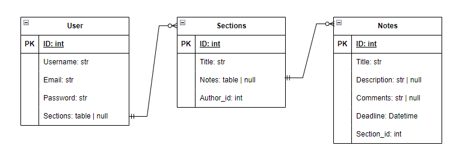

# Задача

Реализовать канбан доску с использованием JWT, [FastAPI](https://fastapi.tiangolo.com/), PostgreSQL, [RabbitMQ](https://www.rabbitmq.com/), Docker

## Описание приложения:

1. Реализована регистрация и **Oauth2** авторизация пользователя с шифрованием пароля.
2. Вход осуществляется по электронной почте и паролю.
3. Восстановление пароля принимает на вход электронную почту и отправляет на неё письмо с токеном для ресета пароля.
4. Пользователь может создавать, изменять и удалять секции. Удаление доступно только если в секции нет заметок.
5. Пользователь может создавать, изменять, перемещать по секциям и удалять заметки.
6. Экспорт доски в XML формат реализован с помощью **RabbitMQ**. Запросом `Post /export_send` доска отправляется в очередь брокера.
Затем в методе `recieve_message` форматируется тело сообщения в XML формат и записывается в файл **board.xml**.

Для фронтэнда использовался фреймворк [Vue.js](https://vuejs.org/) вместе с библиотекой [Vuex](https://vuex.vuejs.org/) для хранения данных в централизованном хранилище и управления ими.

## Схема базы данных


## Запуск

Для запуска необходимо выполнить команду:

```
$ docker-compose up -d --build
```
И затем применить миграции командой:
```
$ docker-compose exec backend aerich upgrade
```